# Week-2

## **Day 1**
### Javascript Dasar
- Scope and Function
  - Scope<br/>
    Scope adalah konsep dalam flow data variabel. Menentukan suatu variabel bisa diakses pada scope tertentu atau tidak.
    - Blocks<br/>
      Blocks adalah code yang berada didalam curly braces {}. Conditional, function, dan  looping menggunakan blocks.
    - Global Scope<br/>
      Global scope berarti variabel yang kita buat dapat diakses dimanapun dalam suatu file. Agar menjadi Global Scope, suatu variabel harus dideklarasikan diluar Blocks.
      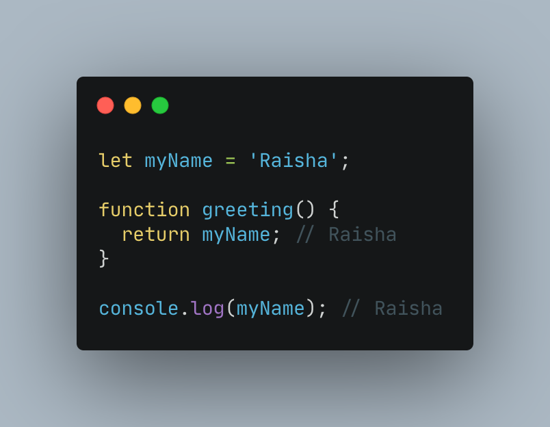
    - Local Scope<br/>
      Local scope berarti kita mendeklarasikan variabel didalam blocks seperti function, conditional, dan looping. Maka variabel hanya bisa diakses didalam blocks saja. Tidak bisa diakses diluar blocks.
      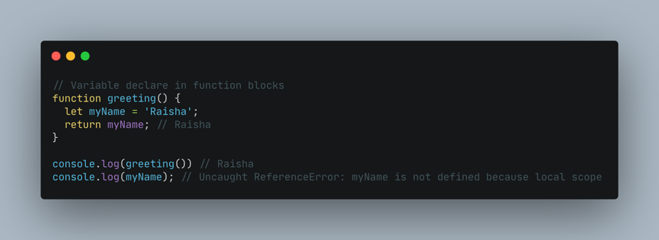
  - Function<br/>
    Function adalah sebuah blok kode dalam sebuah grup untuk menyelesaikan 1 task/1 fitur. Saat kita membutuhkan fitur tersebut nantinya, kita bisa kembali menggunakannya.
    - Membuat Function<br/>
      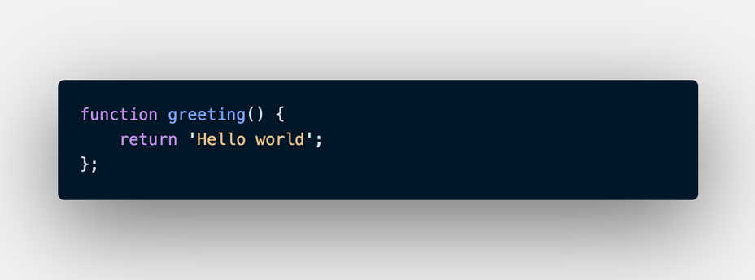<br/>
      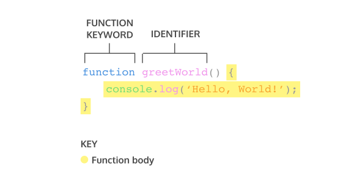
    - Mengakses Function <br/>
      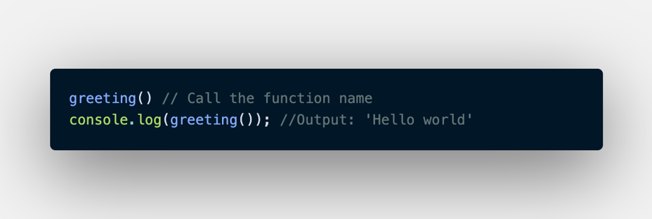<br/>
      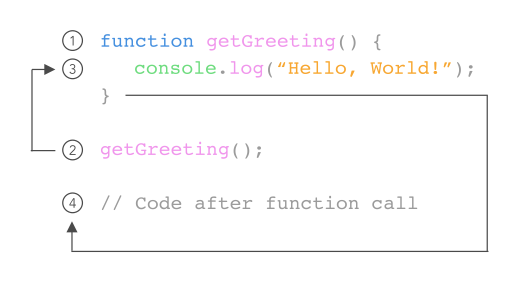
  - Parameter dan Argument
    - Parameter<br/>
      Dengan parameter, function dapat menerima sebuah inputan data dan menggunakannya untuk melakukan task/tugas. Saat membuat function/fitur, kita harus tahu data-data yang dibutuhkan. Misalnya saat membuat function penambahan 2 buah nilai. Data yang dibutuhkan adalah 2 buah nilai tersebut.<br/>
      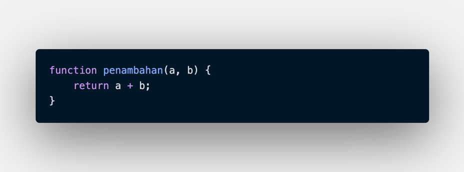<br/>
      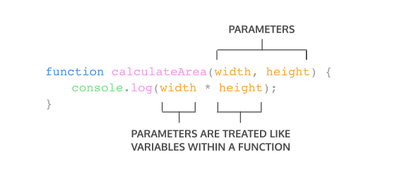
    - Argument<br/>
      Argumen adalah nilai yang digunakan saat memanggil function. Jumlah argumen harus sama dengan jumlah parameternya Jadi jika di function penambahan ada 2 parameter nilai saat membuat function. Saat memanggil function kita gunakan 2 buah nilai argumen.
      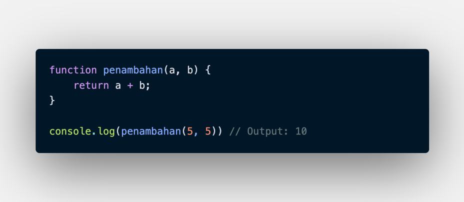<br/>
      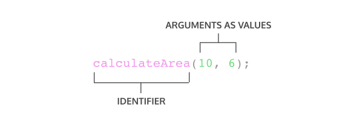
  - Default Parameter<br/>
    Default paramaters digunakan untuk memberikan nilai awal/default pada parameter function. Default parameters bisa digunakan jika kita ingin menjaga function agar tidak error saat dipanggil tanpa argumen.
    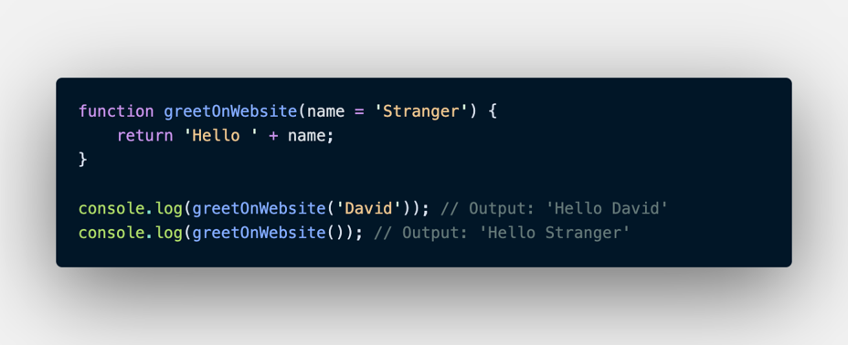
  - Function Helper<br/>
    Menggunakan function yang sudah dibuat pada function lain.
    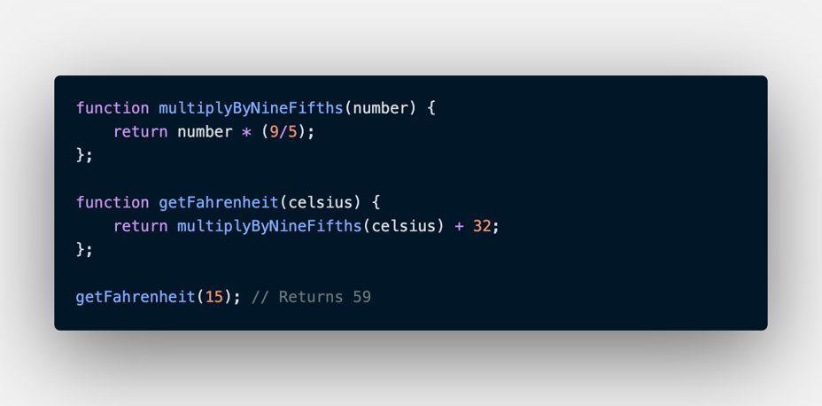
  - Arrow Function<br/>
    Arrow function adalah cara lain menuliskan function. Ini adalah fitur terbaru yang ada pada ES6 (Javascript Version).
    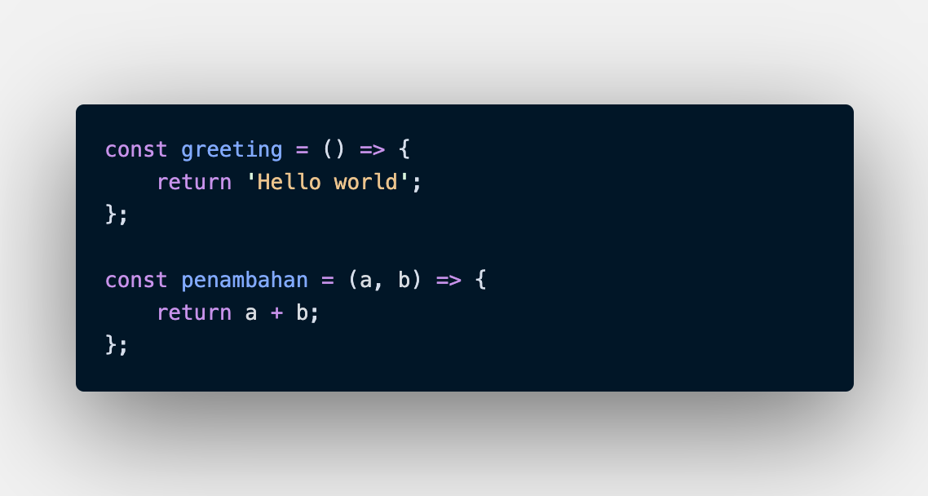
  - Sort Syntax Function
    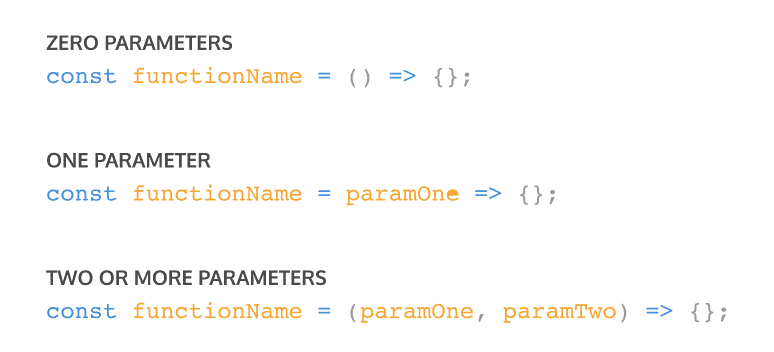<br/>
    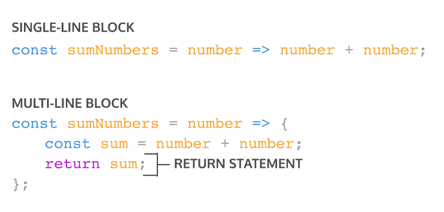

Pada saat mengembangkan aplikasi dengan skala besar, function sangat sangat dibutuhkan agar kita dapat dengan mudah memanage code dan tracing code jika ada error.

## **Day 2**
### Data Type Built in Prototype & Method
Data type adalah tipe data. Data types dibagi menjadi 2 kategori primitive dan non-primitive, tipe data dijavascript tidak memiliki fondasi yang kuat contohnya kita bisa merubah-ubah tipe data.
- Data Primitive<br/>
  Tipe data primitive merupakan tipe data yang bersifat immutable, artinya dalam tipe data jenis ini nilai tidak dapat dirubah atau di manipulasi.
  1. Boolean<br/>
     Tipe data boolean mengambarkan entitas logika, boolean hanya memiliki 2 kondisi yaitu true dan false.
  2. String<br/>
     Tipe data string adalah grup karakter yang ada pada keyboard laptop/PC kita yaitu letters (huruf), number (angka), spaces (spasi), symbol, dan lainnya.
  3. Number<br/>
     Tipe data number adalah tipe data yang mengandung semua angka termasuk angka desimal.
  4. BigInt<br/>
     Bigint adalah integer presisi yang mampu mewakili bilangan bulat uang lebih besar dari 253 -1.
  5. Symbol<br/>
     Tipe data symbol diperkenalkan oleh ES6, symbol merupakan tipe data primitive yang bersifat immutable(tidak dapat berubah).<br/>
     Setiap tipe data symbol akan mengembalikan dengan nilai Symbol() karena penggunaan tipe data ini menggunakan fungsi Symbol().<br/>
     Karena tujuan dari penggunaan fungsi symbol adalah untuk melakukan identifikasi property pada objek dikarenakan tipe data symbol bersifat unik.
  6. Null<br/>
     Tipe data null adalah tipe data yang diartikan bahwa sebuah variable/data tidak memiliki nilai. Null berbeda dengan string kosong. String kosong masih memiliki tipe data string.
  7. Undefined<br/>
     Tipe data undefined adalah tipe data yang merepresentasikan varibel/data yang tidak memiliki nilai. Undefined berbeda dengan null.
- Data Non-Primitive<br/>
  1. Function
  2. Array
  3. Object

Method adalah tindakan yang dapat dilakukan pada objek. Method JavaScript adalah properti yang berisi definisi fungsi.
- toLowerCase()<br/>
  Mengubah string menjadi huruf kecil semua.
- toUpperCase()<br/>
  Mengubah string menjadi huruf besar semua.
- charAt()<br/>
  Method charAt digunakan untuk mengembalikan string baru dan hanya 1 karakter saja. Method charAt ini akan mengembalikan sebuah karakter berdasarkan indeks (number) yang sudah ditentukan.
- includes()<br/>
  Method includes digunakan untuk melakukan pencarian. Jika ditemukan akan mengembalikan nilai true, sedangkan jika tidak ditemukan maka akan mengembalikan nilai false.
- split()<br/>
 Method split membutuhkan sebuah pola, lalu dari pola tersebut akan membagi dari string yang kita tuju. Setelah dibagi, akan membuat data array.

Math merupakan objek bawaan yang memiliki properti dan metode untuk konstanta dan fungsi pada matematika.
- abs(), digunakan untuk mengembalikan nilai absolut (angka bulat) dan tidak boleh ada min(negatif).
- pow(), digunakan untuk menampilkan pangkat.
- sqrt(), digunakan untuk menampilkan akar.
- round(), digunakan untuk membulatkan angka desimal menjadi bilangan bulat.
- floor(), digunakan untuk membulatkan angka desimal ke bawah.
- ceil(), digunakan untuk membulatkan angka desimal ke atas.
- random(), digunakan untuk menampilkan angka secara acak antara 0 hingga 1 (0 termasuk. 1 tidak).

## Day 3
### DOM (Document Object Model)
Document Object Model adalah Jembatan supaya bahasa pemrograman dapat berinteraksi dengan dokumen HTML. Dengan DOM, kita dapat memanipulasi JS DOM bukan bagian dari JavaScript, tapi merupakan web API. Jadi bisa digunakan dalam bahasa pemrograman lain. Ketika file HTML di load, DOM dalam bentuk struktur seperti tree.<br/>
- Traversing DOM ke bawah
  Mencari sbeuah element DOM
  ```
    document.getElementById("myId");
    // mengembalikan dalam bentuk html element

    document.getElementsByClassName("myClass");
    // mengembalikan html collection

    document.getElementsByTagName("p");
    // mengembalikan html collection

    // query selector(s) menggunakan css selector untuk memilih sesuatu
    document.querySelector("div > p");
    // mengembalikan p pertama dengan parent div

    document.querySelectorAll("ul > li");
    // mengembalikan seluruh li dengan parent ul nilai pengembalian 
    // html collection
   ```

- Traversing DOM ke atas
  - ParentElement
    ```
        let itemQuery = document.querySelector(".item")
        console.log(itemQuery)
        console.log(itemQuery.parentElement);
    ```
  - closet()
    ```
        let itemQuery = document.querySelector(".item")
        console.log(itemQuery)
        console.log(itemQuery.parentElement);
        console.log(itemQuery.closest("body));
    ```
- Traversing DOM ke samping
  - nextElementSibling
    ```
        let itemQuery = document.querySelector(".item")
        console.log(itemQuery.nextElementSibling);
    ```
  - previousElementSibling
    ```
        let itemQuery = document.querySelector(".item")
        console.log(itemQuery.previousElementSibling);
    ```
## Day 4
### Manipulation DOM (Document Object Model)
DOM untuk manipulasi seperti menambah element di HTMl, create element, append ke sebuah element, remove, dsb.
1. Element.innerHTML, untuk mengubah konten HTML di dalam sebuah element.
1. Element .createElement(), untuk membuat elemen.
1. Element.append, untuk menambahkan element ke dalam parents baik berupa object node maupun DOM String.
1. Element.appendChild, untuk menambahkan element ke dalam parents baik berupa object node tetapi tidak bisa menggunakan DOM String.
1. Remove(), untuk menghapus elemen (atau node) dari dokumen
1. link. attribute, untuk melihat dan mengecek attribute apa yang pada file html.
1. SetAttribute, untuk menambahkan attribute
1. link.style, untuk memberikan styling pada file html dengan DOM.
1. link.style.removeProperty(), untuk menghapus style properti.
1. Mendapatkan style dari element
1. List of class, Menambahkan class, Menghapus class

## Day 5
### Event DOM (Document Object Model)
Event adalah kejadian yang terjadi di halaman web. Kejadian yang dimaksud di sini seperti aktivitas yang dikerjakan pada halaman web.
- Menggunakan Atribute
    <br/>
    onclick adalah atribut HTML untuk menentukan aksi saat event klik pada sebuah elemen. Atribut ini bisa diisi dengan nama fungsi atau ekspresi javascript. Selain event onclick ada juga event lainnya seperti onchange, onmouseover, onkeyup, onload, dll.
- Method addEventListener()<br/>
    Method addEventListerner() merupakan method yang terdapat pada object DOM. Object ini mewakili sebuah elemen HTML di Javascript.
    
- eventProperty
    ```
    h1.onclick = function(){
            alert("Ini adalah Heading")
        }
    ```