# Week-3

## **Day 1**
### Javascript Intermediate
#### **Array**
Array adalah tipe data list order yang dapat menyimpan tipe data apapun di dalamnya.<br/>
Array dapat menyimpan tipe data String, Number, Boolean, dan lainnya.<br/>
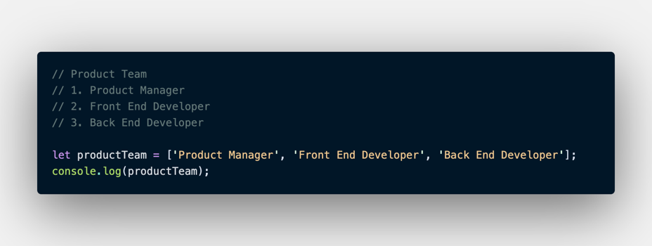
1. Membuat Array<br/>
   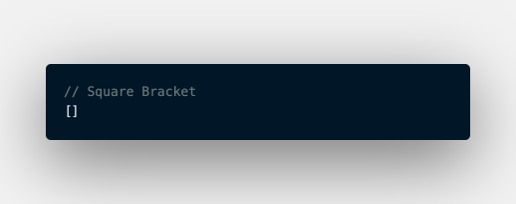
2. Memanggil Array<br/>
   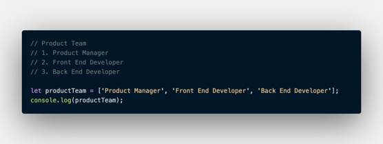
3. Update Array<br/>
   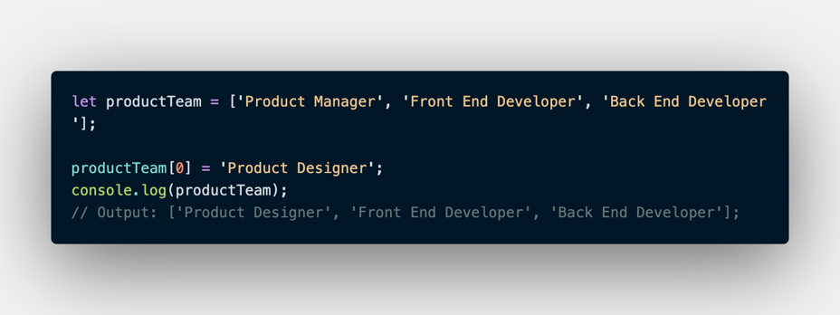
4. Const in Array<br/>
   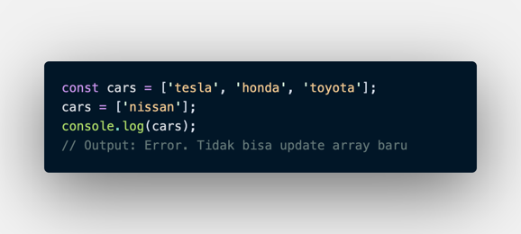<br/>
   Const tidak bisa melakukan update data. Namun pada Array kita dapat melakukan update konten nilai di dalam array (mutable).
5. Array Properties<br/>
   Array memiliki 5 properti yang sering digunakan yaitu constructor, length, index, input, dan prototype.
   - .length<br/>
     length akan mengembalikan nilai dari jumlah panjang data suatu array.<br/>
     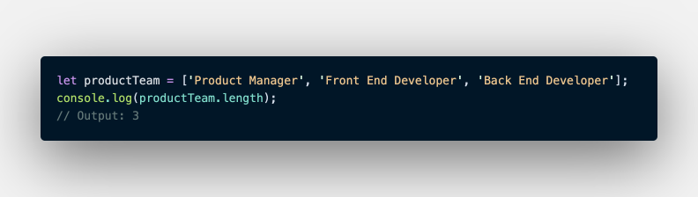
6. Array Method<br/>
   Array memiliki method atau biasa disebut built-in methods.<br/>
   Artinya Javascript sudah memudahkan kita dengan menyediakan function/method umum yang bisa kita gunakan.<br/>
   - .push()<br/>
     .push() adalah method untuk menambahkan item  array pada urutan yang paling akhir.<br/>
     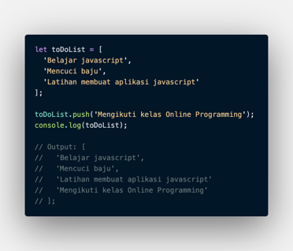
   - .pop()<br/>
     .pop() adalah method yang menghapus item array index terakhir.<br/>
     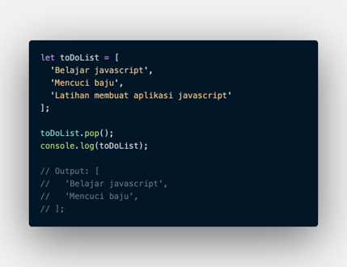
   - .shift()<br/>
     .shift() adalah method untuk menghapus item Array pada index pertama.<br/>
     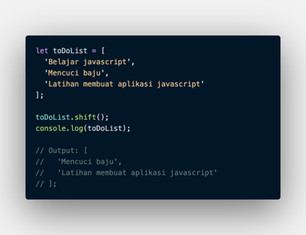
   - .unshift()<br/>
     .unshift() adalah method untuk menambahkan item Array pada index pertama.<br/>
     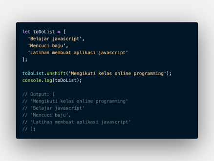
   - .sort()<br/>
     .sort() adalah method untuk mengurutkan secara Ascending atau Descending Alphanumeric.<br/>
     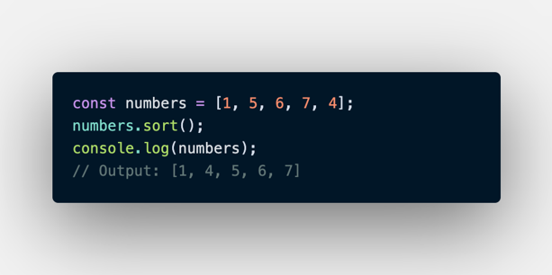

7. Looping pada Array<br/>
   Array memiliki built in methods untuk melakukan looping yaitu .map() dan .forEach().
   - .forEach()<br/>
     .forEach() adalah method untuk melakukan looping pada setiap elemen array.<br/>
     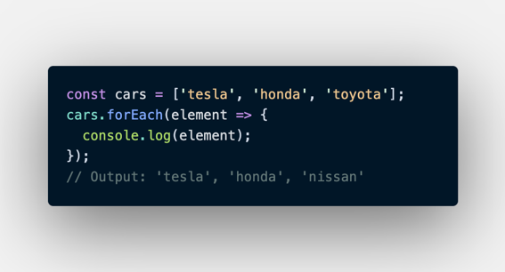
   - .map()<br/>
     .map() melakukan perulangan/looping dengan membuat array baru.<br/>
     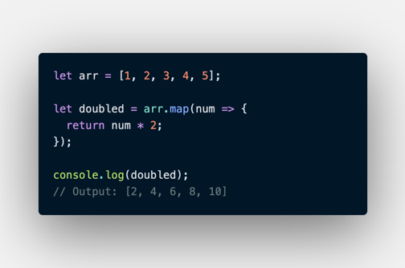
   
    Gunakan .forEach() jika hanya memerlukan looping untuk menampilkan saja atau menyimpan ke database.<br/>
    Gunakan .map() jika akan melakukan operasi pada array seperti yang dapat mengubah nilai array sebelumnya.

#### **Multidimensional Array**
Multidimensional Array bisa dianalogikan dengan array of array.<br/>
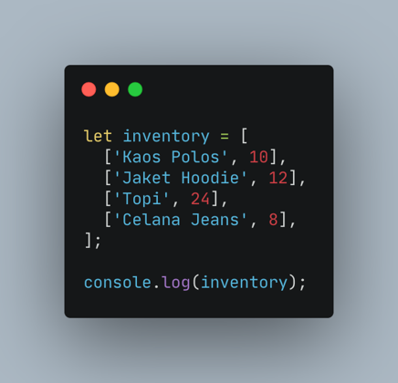
- Akses index multidimensional array
  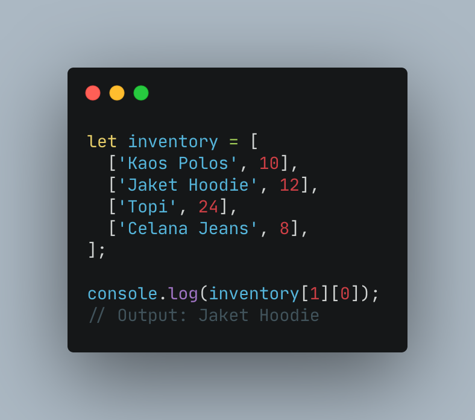<br/>
  Sama seperti array satu dimensi, multidimensional array juga dapat menggunakan Property dan Method built-in Array.
- Operation using map in multidimensional array
  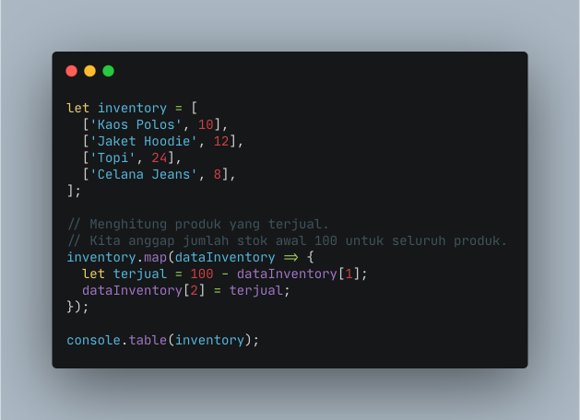
- Looping for multi dimensional Array
  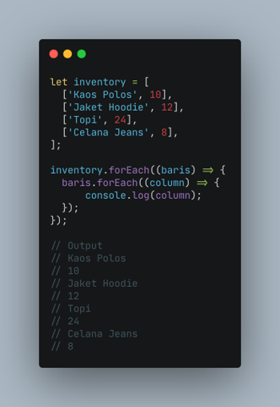
  - Using for loop
    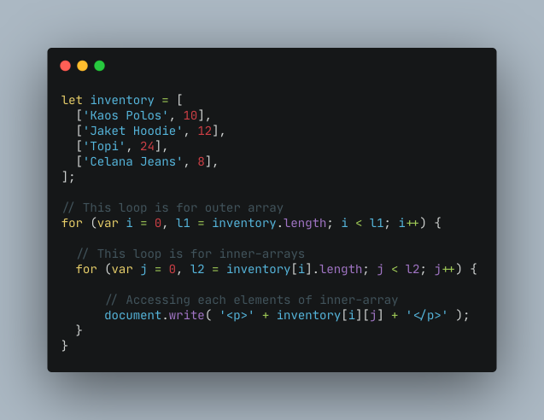

## **Day 2**
### Javascript Intermediate
#### **Object**
Object adalah sebuah tipe data pada variabel yang menyimpan properti dan fungsi (method).
1. Membuat sebuah objek<br/>
   Object dapat diassign kedalam sebuah variabel.<br/>
   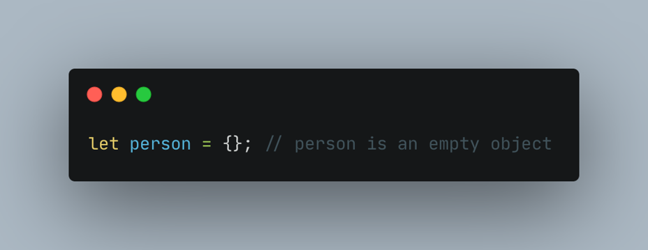
2. Mengakses Object dan Property Object<br/>
   - Mengakses seluruh properti<br/>
   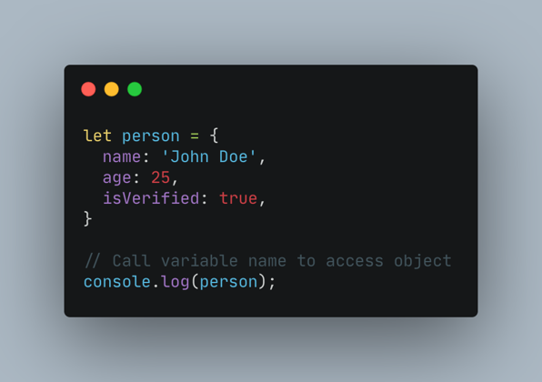
   - Mengakses properti Object<br/>
     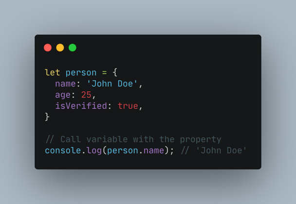
   - Bracket Notation<br/>
     Kita juga bisa menggunakan bracket notation saat memanggil properti dari sebuah object.<br/>
     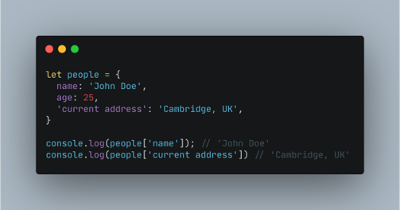
3. Update Object<br/>
   Object dapat mengupdate value dari key yang sudah tersedia. Object dapat menambahkan key dan value baru.<br/>
   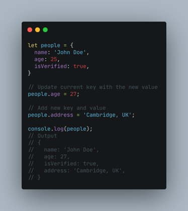
4. Delete Object Properties<br/>
   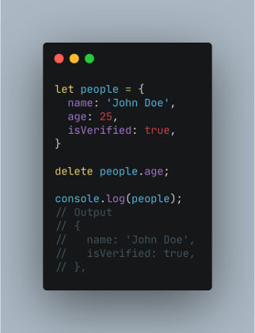
5. Method<br/>
   Method merupakan value yang di masukkan pada property berupa function.
   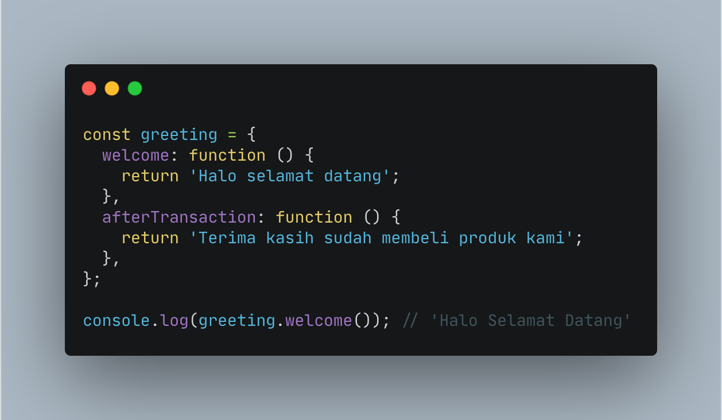
6. Nested Object<br/>
   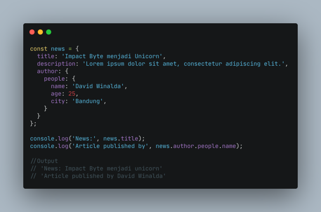
7. Pass by reference<br/>
   Mengubah data yang ada pada object melalui sebuah function dan memasukkan object sebagai parameter function.<br/>
   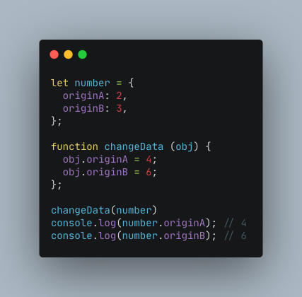
8. Looping Object
   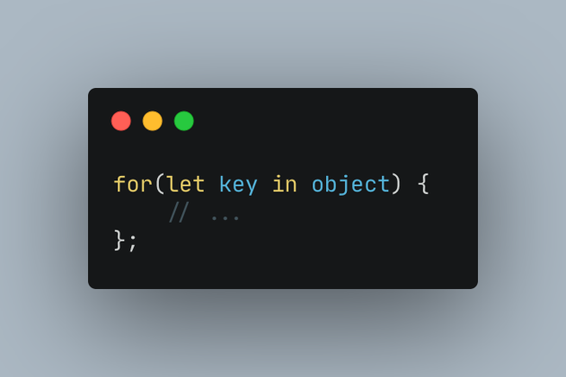
9. Array of Object<br/>
   Object sama seperti Array yang bisa menyimpan banyak data.Kita dapat menggunakan array of object untuk data yang lebih dari satu.<br/>
   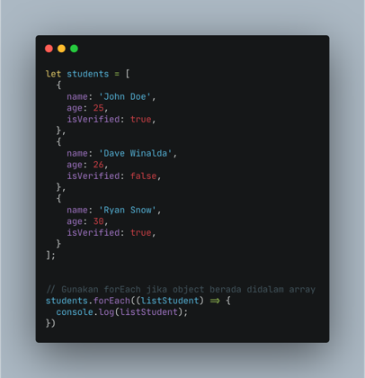

## **Day 3**
### Javascript Intermediate
#### **Recursive**
Recursive adalah function yang memanggil dirinya sendiri sampai kondisi tertentu.<br/>
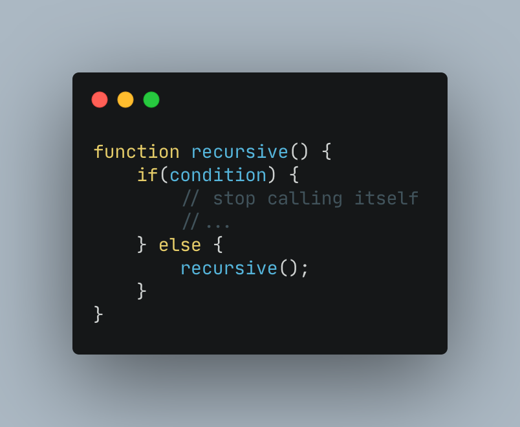<br/>
CIri rekursif:
1. Fungsi rekursif selalu memiliki kondisi yang menyatakan kapan fungsi tersebut berhenti. 
2. Fungsi rekursif selalu memanggil dirinya sendiri sambil mengurangi atau memecahkan data masukan setiap panggilannya. 
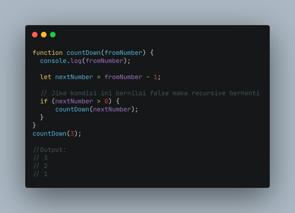


## **Day 4**
### Javascript Intermediate
#### **Asynchronous**
Async/await adalah fitur yang hadir sejak ES2017. Fitur ini mempermudah kita dalam menangani proses asynchronous.Async/Await merupakan sebuah syntax khusus yang digunakan untuk menangani Promise agar penulisan code lebih efisien dan rapih.<br/>
Menjalankan Asynchronous
1. setTimeout(function, milliseconds) digunakan untuk simulasi pemanggilan kembali proses asynchronous yang sedang/sudah selesai dijalankan. Pemanggilan hanya dilakukan 1 kali.
```
setTimeout(() => {
  console.log("Cuci baju"); // proses asynchronous
}, 1000);
console.log("Menyapu");
console.log("Mengepel");
console.log("Memasak");

// 1000 ms = 1 second

// Output:
// Menyapu
// Mengepel
// Memasak
// Cuci baju
```
2. setInterval(function, milliseconds) digunakan untuk simulasi pemanggilan proses asynchronous yang sedang/sudah dijalankan dalam interval waktu tertentu. Pemanggilan dilakukan berkali-kali sesuai interval waktu yang ditentukan.
```
setInterval(() => {
  console.log("Cuci baju"); // proses asynchronous
}, 3000);
console.log("Menyapu");
console.log("Mengepel");
console.log("Memasak");

// 3000 ms = 3 second

// Output:
// Menyapu
// Mengepel
// Memasak
// Cuci baju (x time)

// Cuci baju akan dijalankan setiap 3 detik sekali
```

- Menerapkan asynchronous<br/>
  ```
  const user = getUser(); // fungsi async untuk mengambil data user dari API
  console.log(user) // Output: null
  ```
  1. Callback<br/>
     Callback adalah sebuah function, namun bedanya dengan function pada umumnya adalah pada cara eksekusinya.
     - Menggunakan Callback<br/>
       ```
        function proses1() {
        console.log("proses 1 selesai dijalankan");
        }

        function proses2(callback) {
        setTimeout(function () {
        console.log("proses 2 selesai dijalankan");
            callback();
        }, 100);
        }

        function proses3() {
        console.log("proses 3 selesai dijalankan");
        }
        proses1();
        proses2(proses3);

        /*
        Hasil Output
        proses1 selesai dijalankan
        proses2 selesai dijalankan
        proses3 selesai dijalankan
        */
       ```
     - Membuat Callback<br/>
       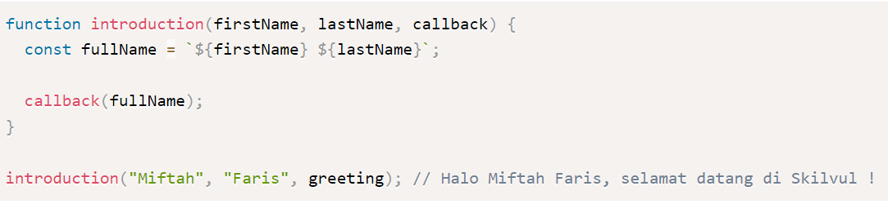
  2. Promise<br/>
     Konsep promise hadir untuk memecahkan masalah yang bertele-tele dengan callback, semakin banyak kita menggunakan callback untuk proses asynchronous semakin kompleks dan sulit kode kita untuk dibaca dan dipelihara. <br/>
     Status Promise:
     - pending, jika data sedang diproses.
     - fulfilled, jika data telah berhasil didapatkan.
     - rejected, jika data gagal didapatkan.

     Contoh menggunakan promise<br/>
     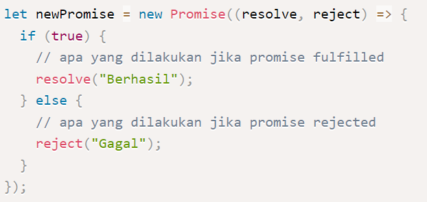
     - Penggunaan promise fullfield<br/>
       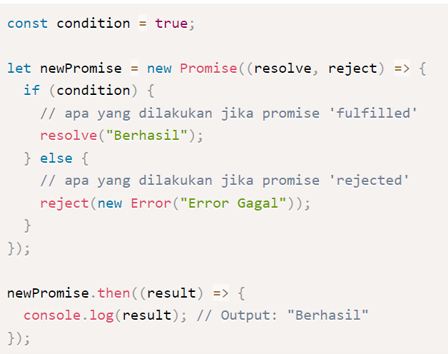
     - Penggunaan promise Rejected<br/>
       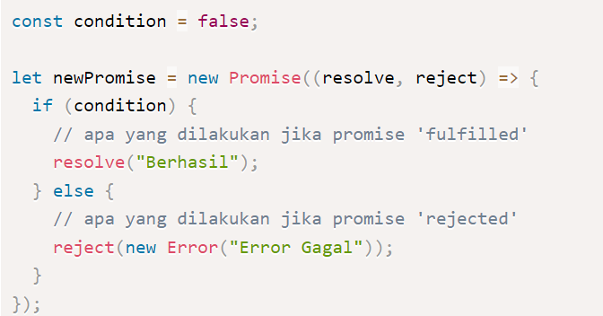

## **Day 5**
### Javascript Intermediate
#### **Web Storage**
Web Storage digunakan untuk menyimpan data pengguna seperti pencarian, artikel berita, dan lain-lain ke lokal (browser) menggunakan cookies, local storage, dan session storage.
1. Cookies<br/>
  Cookies adalah data kecil yang dikirim dari situs web dan disimpan di komputer kita oleh web browser saat kita menjelajah. Disebut data kecil karena maksimum data yang dapat disimpan dalam cookies adalah 4096 bytes (4 KB).<br/>
  Kekurangan cookies:
    - Setiap kita mengakses situs web, cookies juga kembali dikirim sehingga memperlambat aplikasi web kamu dengan mengirimkan data yang sama.
    - Cookies disertakan pada setiap HTTP request, sehingga mengirimkan data yang tidak dienkripsi melalui internet, maka saat kita ingin menyimpan data dalam cookies kita harus mengenkripsinya terlebih dahulu.
    - Cookies hanya dapat menyimpan data sebanyak 4KB.
    - Lalu cookies juga memiliki tanggal kadaluarsa. Tanggal ini telah ditentukan sehingga web browser bisa menghapus cookies jika tanggal sudah kadaluarsa atau tidak dibutuhkan.
2. Local Storage<br/>
  Local storage memiliki karakteristik sebagai berikut:
    - Menyimpan data tanpa tanggal kadaluarsa.
    - Data tidak akan dihapus ketika web browser ditutup dan akan tersedia seterusnya selama kita tidak menghapus data local storage pada web browser.
    - Dapat menyimpan data hingga 5MB.
    - Hanya dapat menyimpan data string.

  - Menyimpan Data<br/>
    Untuk menyimpan data pada local storage, kita menggunakan method setItem() yang membutuhkan 2 parameter. Parameter pertama adalah key yang ingin kita simpan dan parameter kedua adalah data (value) dari key yang akan disimpan.

        localStorage.setItem('key', value);
  - Mengambil Data<br/>
    Untuk mengambil data yang telah tersimpan pada local storage, kita dapat menggunakan method getItem() yang membutuhkan 1 parameter. Parameter tersebut adalah key dari data yang kita inginkan.

        localStorage.getItem('key');
  - Menghapus Data<br/>
    Untuk menghapus data yang telah tersimpan pada local storage, kita dapat menggunakan method removeItem() yang membutuhkan 1 parameter. Parameter tersebut adalah key dari data yang ingin kita hapus.

        // menghapus key tertentu
        localStorage.removeItem("key");

        // menghapus semua key
        localStorage.clear();
3. Session Storage<br/>
  Session storage mempunyai beberapa karakteristik, yaitu:
    - Data yang disimpan pada session storage akan terus tersimpan selama browser terbuka dan tidak hilang jika laman di-reload.
    - Membuka banyak tab/window dengan URL yang sama, akan menciptakan session storage yang berbeda di masing-masing tab/window.
    - Menutup tab/window akan mengakhiri session dan menghapus data yang tersimpan di session storage pada tab/window tersebut.
    - Data yang tersimpan dalam session storage harus berbentuk string.
    -. Hanya dapat menyimpan data sebanyak 5MB.

  - Menyimpan Data<br/>
    Sama dengan local storage, sintaks untuk menyimpan data pada session storage adalah sebagai berikut:

        // menambah session storage
        sessionStorage.setItem('key', value);
  - Mengambil Data<br/>
    Sama seperti local storage, cara mendapatkan data dari session storage juga menggunakan getItem(), seperti berikut ini:
    
        // mendapatkan session storage
        sessionStorage.getItem('key');
  - Menghapus Data<br/>
    Syntax untuk menghapus data dari session storage ada 2, yaitu:

        // menghapus session storage satu persatu berdasarkan key
        sessionStorage.removeItem('key');

        // menghapus seluruh session storage sekaligus
        sessionStorage.clear();