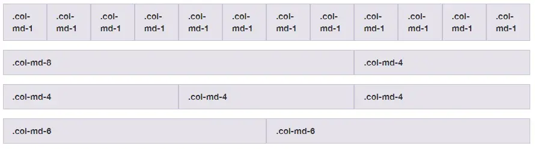

# Week-4

## **Day 1**
### **Javascript Intermediate**
#### **Async/Await**
Async-await adalah salah satu cara untuk menangkap promise selain menggunakan then() & catch().
Contoh Penggunaan:

    const getAllUser = async ()=> {
	    try {
		    const result = await getUser()
		    console.log(result)
	    } catch (error) {
		    console.log(error)
	    }
    }
#### **Fetch**
Fetch adalah sebuah objek promise untuk mengambil data dari API yang di handle menggunakan promise atau async-await. API adalah jembatan komunikasi ke server untuk mendapatkan data. Karena fetch mengembalikan sebuah Promise, maka untuk response handling nya kita gunakan fungsi then (jika Promise tersebut mengembalikan resolve) dan catch (jika Promise tersebut mengembalikan reject). 
Contoh penggunaan:

    fetch('<URL-to-the-resource-that-is-being-requested>')
        .then(function (response) {
            return response.json()
        })
        .catch(function (err) {
            console.log(`Ups, ${err} :(`)
        })

### **Git & Github Lanjutan**
1. git clone<br/>
  Perintah yang digunakan untuk membuat salinan repository lokal.

        git clone <url repository>
2. git branch<br/>
  Sebuah perintah agar bisa melihat seluruh branch yang terdapat pada repository

        git branch nama-branch
    - Membuat branch
      1. ```git branch``` : menampilkan semua branch
      2. ```git branch nama-branch``` : membuat branch baru dengan nama nama-branch
    - Berpindah Branch
      1. ```git checkout nama-branch``` : mengganti branch ke nama-branch
      2. ```git checkout -b nama-branch``` : membuat branch baru dengan nama nama-branch dan langsung mengganti branch ke nama-branch
    - Menggabungkan Branch
      1. ```git merge nama-branch``` : menggabungkan branch nama-branch ke branch yang sedang aktif
      2. ```git merge nama-branch --no-ff``` : menggabungkan branch nama-branch ke branch yang sedang aktif tanpa menghapus branch nama-branch
      3. ```git merge nama-branch --squash``` : menggabungkan branch nama-branch ke branch yang sedang aktif dengan menggabungkan semua commit menjadi satu commit baru
      4. ```git merge nama-branch --abort``` : membatalkan merge branch nama-branch ke branch yang sedang aktif dan mengembalikan branch yang sedang aktif ke kondisi sebelum merge
      5. ```git merge --abort``` : membatalkan merge branch ke branch yang sedang aktif dan mengembalikan branch yang sedang aktif ke kondisi sebelum merge
      6. ```git merge --continue``` : melanjutkan merge branch ke branch yang sedang aktif setelah mengatasi konflik
      7. ```git merge --no-commit``` : menggabungkan branch ke branch yang sedang aktif tanpa membuat commit
    - Menghapus Branch
      1. ```git branch -d nama-branch``` : menghapus branch nama-branch
      2. ```git branch -D nama-branch``` : menghapus branch nama-branch tanpa memeriksa apakah branch nama-branch sudah di merge atau belum ke branch yang sedang aktif
      3. ```git branch -m nama-branch``` : mengganti nama branch yang sedang aktif menjadi nama-branch baru
      4. ```git branch -M nama-branch``` : mengganti nama branch yang sedang aktif menjadi nama-branch baru tanpa memeriksa apakah branch yang sedang aktif sudah di merge atau belum ke branch master
3. Pull Request<br/>
  Pull request adalah suatu permintaan untuk menggabungkan (merge) kode yang kita modifikasi dengan repositori utama atau repositori lain.
    - Membuat Pull Request
      1. Buka repository Github
      1. Pilih branch yang akan digabungkan ke branch master
      1. Klik tombol Pull Request
      1. Isi judul dan deskripsi pull request
      1. Klik tombol Create Pull Request
    - Menerima Pull Request
      1. Buka repository Github
      1. Pilih tab Pull Request
      1. Pilih pull request yang akan diterima
      1. Klik tombol Merge Pull Request
      1. Klik tombol Confirm Merge
4. Menghindari konflik saat berkolaborasi
   - Langkah - langkah :
     1. Periksa baris kode dan file yang sedang terjadi konflik
     1. Segera lakukan konfirmasi kepada para anggota yang berkolaborasi
     1. Anggota yang mengalami konflik harus melakukan pull
     1. Lakukan merge untuk melihat konfliknya
     1. Lakukan diskusi dengan kelompok untuk menentukan code mana yang akan dipakai
     1. Lalu lakukan proses stagged sampai commit, dan push file ke repository
5. Melakukan kolaborasi dengan GitHub kolaborasi
   - Langkah - langkah :
     1. Cari buttom "plus" / "+"
     1. Lalu pilih "new organization"
     1. Pilih "Create a free organization"
     1. Isi data sampai selesai
     1. Pilih "Create new repository"
     1. Sebagai seorang leader, lakukan push file pertama ke dalam repository yang telah dibikin dengan branch utama yaitu main atau master
     1. Masukan branch dev untuk fase pengembangan
     1. Invite anggota yang akan diajak untuk berkolaborasi
     1. Setiap anggota melakukan cloning terhadap repository yang ada
     1. Saat melakukan push ke dalam GitHub, maka anggota harus menggunakan branch berdasarkan fitur yang dibuat, bukan dev, main, dan master
     1. Anggota akan membuat pull request
     1. Leader akan menerima pull request
     1. Leader akan melakukan merge ke branch dev sebagai branch untuk proses pengembangan
     1. Setelah proses pengembangan selesai, branch dev akan di merge ke dalam branch main
     1. Setiap branch yang telah dibuat dapat dihapus

### **Responsive Web Design**
Responsive web design (RWD) digunakan untuk agar website kita dapat diakses oleh banyak device tanpa mengurangi atau mengubah konten didalamya.
1. Chrome Dev Tools<br/>
   Merupakan tools pada google chrome yang digunakan sebagai tools Responsive Web Design.<br/>
   Untuk mengakses Chrome Dev Tools yaitu<br/>
   ctrl + shift + j ctrl + shift + m digunakan untuk melihat toggle bar
2. Viewport<br/>
   - Dalam menggunakan Responsive Web Design pada bagian HTML perlu ditambahkan viewport pada bagian head agar tampilan website dapat menyesuaikan dengan berbagai device
   - Untuk membuat suatu gambar pada halaman website agar menjadi responsive dapat dilakukan dengan menambahkan atribut Max - width = 100% pada bagian gambar
   - Media Query salah satu cara untuk mengatur suatu website agar bisa terdiri dari beberapa jenis
     1. Penggunaan media query yang umum digunakan adalah min-width dan max-width
     2. Contoh penerapan media query @media screen and (max-width: 500px)
   - Cara mengkondisikan Media Query ada 2 cara yaitu:
     1. Memisahkan beberapa file css sesuai dengan tampilan device yang ingin dibuat
     2. Menggabungkan semua styling css device menjadi 1
   - Breakpoint yaitu istilah saat terjadi perubahan ukuran pada suatu website ketika berganti device
   - Terdapat 3 jenis breakpoint yaitu desktop, tablet, dan mobile phone
   - Penggunaan breakpoint pada media query dapat dilakukan dengan membuat range ukuran sesuai dengan tampilan device yang ingin dibuat

### **JBootstrap 5**
Bootstrap adalah sebuah framework yang paling populer digunakan untuk membuat sebuah website. Bootstrap membuat front-end developer dapat membuat website dengan cepat, fokus pada responsive mobile, dan membuat website menjadi lebih interaktif tanpa membuat banyak CSS dan JavaScript dari nol.
1. Menambahkan Bootstrap<br/>
   [Download](https://getbootstrap.com/docs/5.0/getting-started/download/) _Bootstrap_ untuk mendapatkan _compiled CSS_ dan _Javascript_, _soruce code_, atau bisa menggunakan _package managers_ seperti _npm, RubyGems, yarn_ dan lainnya.
   - npm 
        > $ npm install bootstrap
   - yarn
        > $ yarn add bootstrap
   
   Atau bisa dengan menggunakan _jsDelivr_ untuk mengirimkan versi cache dari _compiled CSS_ dan _JS Bootstrap_. Salin code dibawah ini kedalam project.

        <link href="https://cdn.jsdelivr.net/npm/bootstrap@5.0.2/dist/css/bootstrap.min.css" rel="stylesheet" integrity="sha384-EVSTQN3/azprG1Anm3QDgpJLIm9Nao0Yz1ztcQTwFspd3yD65VohhpuuCOmLASjC" crossorigin="anonymous">
        <script src="https://cdn.jsdelivr.net/npm/bootstrap@5.0.2/dist/js/bootstrap.bundle.min.js" integrity="sha384-MrcW6ZMFYlzcLA8Nl+NtUVF0sA7MsXsP1UyJoMp4YLEuNSfAP+JcXn/tWtIaxVXM" crossorigin="anonymous"></script>
2. Layout
   - Breakpoint<br/>
     Breakpoint adalah lebar yang dapat disesuaikan yang menentukan bagaimana tata letak responsif Anda berperilaku di seluruh perangkat atau ukuran viewport di Bootstrap.<br/>
     Bootstrap menyertakan enam breakpoint default, terkadang disebut sebagai grid tiers, untuk membangun secara responsif.
     
            $grid-breakpoints: (
            xs: 0,
            sm: 576px,
            md: 768px,
            lg: 992px,
            xl: 1200px,
            xxl: 1400px
            );
   - Container<br/>
     Container adalah blok dasar Bootstrap yang berisi, melapisi, dan menyelaraskan konten Anda dalam perangkat atau area pandang tertentu.

     Container adalah elemen tata letak paling dasar di Bootstrap dan diperlukan saat menggunakan sistem grid default. Container digunakan untuk menampung, melapisi, dan (terkadang) memusatkan konten di dalamnya. Meskipun container dapat disarangkan (nested), sebagian besar tata letak tidak memerlukan nested container.

     Bootstrap memiliki 3 container yang berbeda:

     - `.container`, yang menetapkan `max-width` pada setiap _breakpoint_ responsif.
     - `.container-fluid`, yang mana `width: 100%` adalah _breakpoints_.
     - `.container-{breakpoint}`, yaitu `width: 100%` sampai _breakpoint_ yang ditentukan.

     Tabel di bawah mengilustrasikan `max-width` perbandingan setiap penampung dengan aslinya .containerdan `.container-fluid` di setiap titik breakpoint.
   - Grid<br/>
     Sistem Grid adalah sistem yang digunakan Bootstrap untuk mengatur tata letak (layout). Sistem ini terdiri dari 12 kolom dan 6 breakpoint.
    
    Satu kolom penuh panjangnya adalah 12. Jika kolom dibagi dua maka panjangnya akan menjadi 6.
   - Columns <br/>
    Memodifikasi kolom dengan beberapa opsi untuk penyelarasan, pengurutan, dan penyeimbangan berkat sistem kisi flexbox kami. Plus, lihat cara menggunakan kelas kolom untuk mengelola lebar elemen non-kisi.
     - **Alignment** : Gunakan utilitas penyelarasan flexbox untuk menyelaraskan kolom secara vertikal dan horizontal.

             - Vertical alignment
             - Horizontal alignment
     - **Columns Break** : Memecah kolom ke baris baru di flexbox memerlukan sedikit peretasan: tambahkan elemen dengan lebar: 100% di mana pun Anda ingin membungkus kolom ke baris baru. 
    
    
    - Content : Reboot, Typography, Images, Tables dan Figures

    - Forms : Overview, Form control, Select, Checks & radios, Range, Input group, Floating labels, Layout dan Validation

    - Components<br/>
        - Alerts : <br/>
            Berikan pesan umpan balik kontekstual untuk tindakan pengguna biasa dengan beberapa pesan peringatan yang tersedia dan fleksibel.
        - Breadcumb : <br/>
            Sebuah komponen pada website yang berguna sebagai penanda lokasi user sekarang ini pada website anda. Dengan adanya breadcrumb membuat website lebih terasa familiar bagi user atau pengguna
        - Card : <br/>
            Sebuah container yang fleksible untuk content. Pada header ini kita akan membuat div dengan class card-header. Pada bagian body ini kita akan menampilkan content yang lengkap. Secara teknis kita akan membuat div dengan class card-body.
        - Modal : <br/>
            Modal atau yang biasa di sebut dengan pop up pada bootstrap adalah kotak dialog yang biasa di gunakan untuk melakukan konfirmasi . Selain itu modal juga bisa di gunakan untuk melakukan insert , delete, edit data dan form login

        - Pagination : <br/>
            Fitur paging yang biasanya kita temui dalam sebuah tabel yang menampilkan data, dimana datanya akan dibagi menjadi beberapa halaman, nah tugas paging ini untuk membagi data tersebut kedalam beberapa halaman, bootstrap sudah menyiapkan beberapa class yang bisa anda gunakan untuk membuat fitur paging. 