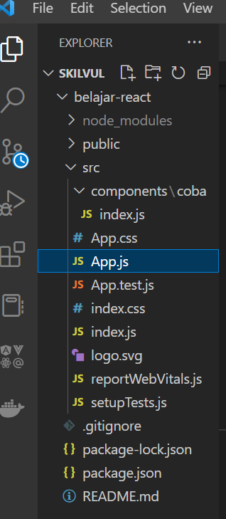
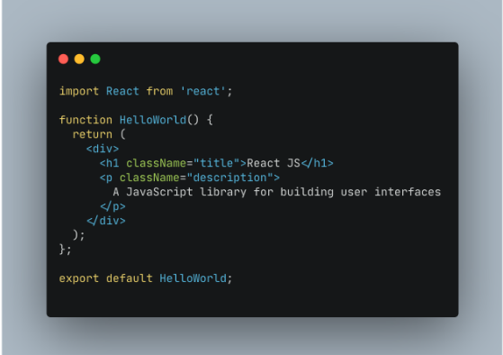
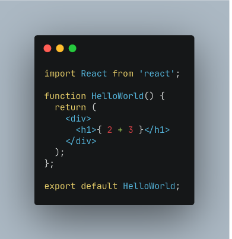
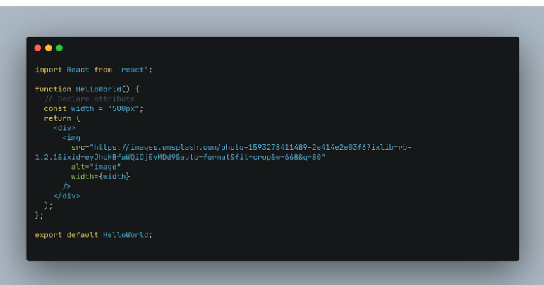
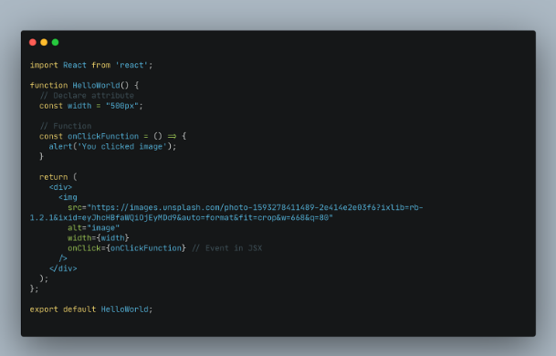
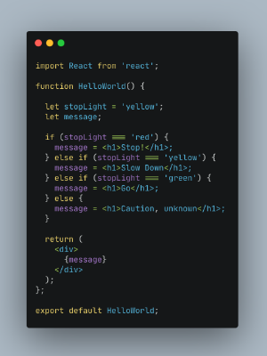
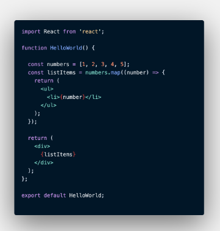
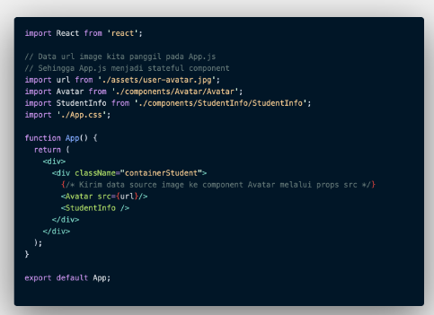
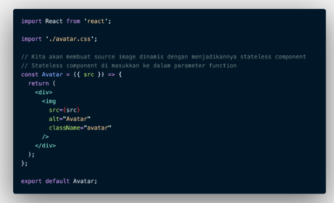

# Week-6

### **REACT JS**
React JS adalah framework view library Javascript untuk emmbuat tampilan (user interface) pada website.<br/>
React JS ini Scallable, sehingga dapat digunakan pada aplikasi berskala kecil hingga besar dan kompleks.
#### **Installasi React**
- Install Node JS
- Membuat library create-react-app
  - npx
    
            npx create-react-app my-app
  - npm
    
            npm init react-app my-app
  - yarn
    
            yarn create react-app my-app
        Perlu diingat juga bahwa penamaan tidak boleh memakai huruf kapital
- Start project
  - npm

            npm start
  - yarn


            yarn start
#### **Penggunaan React**
  <br/>
  Playground utama adalah file app.jsx dimana semua function akan diimport ke file tersebut.<br/>
  JSX adalah extension syntax JavaScript yang digunakan untuk memodifikasi Document Object Model (DOM) dengan kode bergaya HTML
1. JSX Rules<br/>
  Setiap JSX hanya bisa emmiliki 1 parent element
1. The Virtual DOM<br/>
  DOM Manipulation ada Core dari Javascript. Dengan DOM dapat berinteraksi seperti mengupdate data di web page.<br/>
  Virtual DOM adalah duplikasi dari react DOM yang sebenarnya.
1. class dan className<br/>
  Pada JSX atribut class di tag element HTML harus menggunakan className<br/>
  
1. Curly Braces in JSX<br/>
  
1. Variable in JSX<br/>
  Gunakan curly based untuk akses variable pada JSX.<br/>
1. Attribute pada JSX<br/>
  
1. Event in JSX <br/>
   
1. Conditional in JSX<br/>
  
1. .map()<br/>
   

#### **React Component**
Component adalah salah satu core dari React JS. Compoennet juga membagi UI dalam satuan-satuan kecil.
Component dibuat jika component tersebut bersifat reusable code.
- Membuat Component
  - Function
        ```
          function Welcome(props) {
            return        
            <h1>Hello, {props.name} </h1>;
          }
        ```
  - Class
        ```
          class Welcome extends React.Component{

            render() {

              return <h1>Hello, {this.props.name}</h1>;

            }

          }
        ```
- Stateful component<br/>
  
- Stateless component<br/>
  

### **State & Props**
State & Props adalah hal yang berhubungan dengan Stateless dan Stateful COmponent. Stateless berarti tidak memiliki State. Dia hanya memiliki props. Satetful berarti emmiliki state dan bisa mengirim state tersebut ke component.
Jadi, state adalah data lokal. Props digunakan agar component memiliki data yang dinamis yang dikirim dari component lain.

### **Hooks**
Hook adalah fungsi spesial yang memungkinkan Anda “terhubung” dengan fitur-fitur di React. Sebagai contoh, useState adalah sebuah Hook yang memungkinkan Anda memberi state pada function components. 
    ```
    import React, { useState } from 'react';

      function Example() {
        // Deklarasi variabel state baru yang kita sebut "count"
        const [count, setCount] = useState(0);

        return (
          <div>
            <p>Anda menekan sebanyak {count} kali</p>
            <button onClick={() => setCount(count + 1)}>
              Klik saya
            </button>
          </div>
        );
      }
    ```
- Hooks dan function Components<br/>
    ```
      const Example = (props) => {
        // Anda bisa menggunakan Hooks di sini!
        return <div />;
      }
    ```
### **Event**
React dapat melakukan tindakan berdasarkan peristiwa pengguna. React memiliki event yang sama dengan HTML: klik, ubah, arahkan mouse, dll.
- Menambahkan Event
  
      <button onClick={shoot}>Take the Shot!</button>
- Handler Event
    ```
      class Football extends React.Component {
        shoot() {
          alert("Great Shot!");
        }
        render() {
          return (
            <button onClick={this.shoot}>Take the shot!</button>
          );
        }
      }
 
      ReactDOM.render(<Football />, document.getElementById('root'));
    ```

### **Lifecycle and Side Effect**
Terdapat 3 function component maka lifecyle pada react dibagi menjadi 3 fase, yaitu:
1. Mount Ketika website kita sedang dimuat hingga ditampilkan
1. Update Ketika website kita menerima sebuah perubahan atau update dari suatu hal
1. Unmount Ketika website kita mulai menghilang atau berganti

Pada setiap lifecycle tersebut kita bisa memberikan sebuah side effect atau efek samping sesuai lifecycle itu berada.

Pemberian side effect tersebut kita berikan dengan syntax useEffect () sehimgga kita bisa menggunakan callback di dalamnya.

### **Form**
React Form sedikit berbeda dengan HTML Form, React memperkenalkan konsep controlled component dan uncontrolled component.
1. Controlled Components
    ```
      import React, { useState } from 'react';

      export default function App() {
        const [state, setState] = useState('');

        const handleSubmit = () => {
          alert(`Hi ${state}`);
        };

        const handleChange = (e) => {
          setState(e.target.value);
        };

        return (
          <div>
            <h1>Masukan Nama</h1>
            <form onSubmit={handleSubmit}>
              <label>
                Nama:
                <input type="text" value={state} onChange={handleChange} />
              </label>
              <input type="submit" value="Submit" />
            </form>
          </div>
        );
      }
    ```
  Pada code di atas value dari element ```<input> ```disimpan dalam state dan diupdate menggunakan setState(), handler handleSubmit() dieksekusi ketika form disubmit.

1.  Uncontrolled Components<br/>
   ```<input type="file" />``` adalah contoh dari uncontrolled component, karena value tersebut tidak dikontrol oleh React maka untuk mengakses file kita harus menggunakan File API dan Refs.
   Refs dapat digunakan untuk mengakses react element di dalam method render. Untuk membuat Refs kita menggunakan React.createRef() yang dipasang ke sebuah elemen lewat atribut ref.
    ```
        import React from "react";

        export default function App() {
          const fileInput = React.createRef();

          const handleSubmit = (e) => {
            e.preventDefault();
            alert(`Nama file: ${e.fileInput.current.files[0].name}`);
          };

          return (
            <div>
              <h1>Upload File</h1>
              <form onSubmit={handleSubmit}>
                <label>
                  Pilih File 
                  <input type="file" ref={fileInput} style={{marginLeft: "5px"}} />
                </label>
              </form>
            </div>
          );
        }
    ```