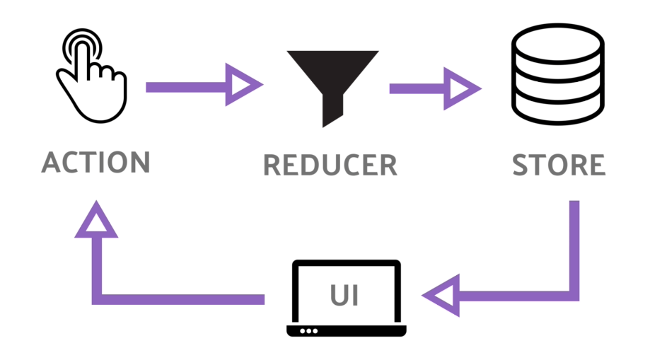
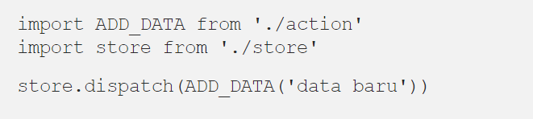

# Week-6

### **REACT JS**
#### **PropTypes**
Prop Types merupakan sebuah lib yang dapat emmbantu untuk memeriksa data props yang dikirim agar sesuai dengan ekspektasi. Jika tidak sesuai, maka akan muncul pesan error
- Install PropTypes<br/>
  
- Contoh penggunaan PropTypes<br/>
  
  

    Props yang akan dikirim harus sesuai dengan tipe data yang diinginkan.
    Kode sperti contoh akan mendapatkan pesan error jika tidak sesuai dengan ekspektasi, seperti berikut<br/>
    

#### **Router**
Routing sendiri adalah proses pemetaan antara sebuah URL ke dalam sebuah halaman yang terdapat konten / UI (User Interface) sesuai dengan URL yang dituju.<br/>
Jika ingin membuat routing membutuhkan library tambahan karena tidak secara langsung tersedia. Ternyata ada beberapa library yang bisa digunakan, diantara library yang sangat familiar adalah react-router dan reach/router. Sebenernya yang dipakai untuk routing di React biasanya react-router-dom anak dari react-router, yang mana selain react-router-dom juga terdapat react-router-native yang bisa digunakan untuk development aplikasi Android dan iOS.
- Install
  
- Membuat project React
  <br/>
  File yang akan kita jadikan sebagai routes yaitu App.js, karena component App yang dijadikan entry point dan dirender pertama kali oleh ReactDOM di index.js.<br/>
  Setelah itu buat routes untuk masing-masing halaman di component App<br/>
  <br/>
  Karena component App dijadikan router, maka component ini akan merender halaman yang path di browser sama dengan path yang ada di route. Jika tidak ada path yang sesuai, maka component yang akan dirender yaitu component Notfound.
  - BrowserRouter digunakan sebagai router yang menggunakan API history dari HTML5, sehingga dapat menggunakan location untuk mensingkronasi UI dengan url. Di dalam object location sendiri merepresentasikan dimana lokasi aplikasi sekarang.
  - Switch digunakan untuk membungkus node Route, yang mana hanya akan merender satu Route saat pathnya cocok dengan URL.
  - Route digunakan untuk merender UI saat path cocok dengan URL saat ini. Di dalam Component Route ini kita menggunakan exact, yang mana bertugas untuk memastikan Route hanya merender component yang memiliki path dan location.pathname yang cocok. Jika tidak ada yang cocok, maka Route yang akan dirender yaitu Route terakhir dengan component Notfound.

  Di halaman Home ini, hanya ada tulisan informasi bahwa sekarang aplikasi berada di halaman Home. Lalu ada sebuah link untuk menuju ke halaman Profil.<br/>
  
  - Element kosong ```<></>``` tersebut adalah shorthand dari ```<React.Fragment></React.Fragment>``` yang mana bisa untuk membungkus child element tanpa menambahkan node ke dalam DOM.
  - ```<Link></Link>``` digunakan untuk berpindah antar halaman, property to tersebut merujuk pada path di Route yang akan dituju.

  Hasilnya akan seperti berikut:
  <br/>
  Pada halaman profil, kita membuat list nama dengan Link yang nantinya akan menuju ke halaman detail profil beserta dengan state yang dibawanya melalui location.

        import React from 'react'
        import { Link } from 'react-router-dom'

        function Profil() {
        return (
            <>
            Profil Page
            <ul>
                <li>
                <Link
                    to={{
                    pathname: "/profil/pevita",
                    state: {
                        name: "Pevita Cleo Eileen Pearce",
                        born: "1992-10-06"
                    }
                    }}
                >
                    Pevita
                </Link>
                </li>
                <li>
                <Link
                    to={{
                    pathname: "/profil/raline",
                    state: {
                        name: "Raline Rahmat Shah",
                        born: "1985-03-04"
                    }
                    }}
                >
                    Raline
                </Link>
                </li>
                <li>
                <Link
                    to={{
                    pathname: "/profil/maudy",
                    state: {
                        name: "Ayunda Faza Maudya",
                        born: "1994-12-19"
                    }
                    }}
                >
                    Maudy
                </Link>
                </li>
            </ul>
            <hr />
            <Link to="/">Home</Link>
            </>
        )
        }

        export default Profil
    
    Di dalam list Link kita menyematkan property to dalam bentuk object location yang akan dituju. Pada saat halaman yang tertuju sesuai pathname, router akan membawa state sesuai yang diberikan halaman sebelumnya. Juga karena halaman detail profil menggunakan parameter dinamis, maka parameter bisa didapet dari props.match.params.
    

#### **React Redux**
Redux adalah salah satu library state management yang biasa disandingkan dengan react. Yaitu dengan menyimpan state di satu tempat, sehingga lebih mudah untuk di manage.

- Setup<br/>
  - redux untuk state managementnya
  - react redux adalah library untuk menghubungkan react dan reduxnya
  - redux-devtools-extention adalah library untuk debuging di browser

  Untuk mulai menggunakan redux, tentu saja kita harus menginstallnya<br/>
  


Ada 3 poin penting dalam redux :
- Store<br/>
  Tugas Store adalah menggabungkan Action dan Reducer agar bisa bekerja sebagai state manajemen.<br/>
  Store bertanggung jawab sebagai:
    - menyimpan keseluruhan state.
    - mengakses state dengan cara getState()
    - menjalankan reducer untuk merubah state dengan cara dispatch(action).

    contoh kode nya:<br/>
    <br/>
    Cara akses state:<br/>
    <br/>
    Cara merubah state<br/>
    

- Reducer<br/>
  Reducer adalah bagian redux yang merubah state menjadi respon yang terjadi ketika Action di dispatch() . Reducer ini hanya sebuah function yang mengembalikan state baru.<br/>
  <br/>
  Jadi yang terjadi adalah jika action yang di dispatch() type nya adalah ADD_DATA maka akan mengembalikan sebuah object baru yang isinya adalah state lama di tambah dengan data baru yang di passing melalui Action. Hasil dari reducer inilah yang akan menjadi state yang baru.
- Action<br/>
  Sederhananya sebuah action merupakan sebuah object yang memiliki property type.<br/>
  
  yang mana object action ini nantinya akan dikirim ke Store dengan cara store.dispatch(ADD_DATA) , untuk kemudian nanti di olah oleh Reducer.<br/>
  Jika di perlukan, Action bisa menampung data dengan cara menambahkan property kedua dalam object Action-nya.<br/>
  <br/>
  Untuk nama property keduanya bebas. Tapi untuk property type tidak boleh diganti. Atau agar data bisa lebih dinamis, kita bisa membuat function yang mengembalikan object action.<br/>
  
  Jika aplikasi kita sudah semakin besar, maka saat nya untuk memisahkan Action ke file yang terpisah.
  
#### **React Redux Thunk**
Redux Thunk adalah middleware yang memungkinkan Anda memanggil pembuat aksi yang mengembalikan fungsi sebagai ganti objek aksi. Fungsi itu menerima metode pengiriman penyimpanan, yang kemudian digunakan untuk mengirim aksi sinkron di dalam isi fungsi setelah operasi asinkron selesai.
- Installasi redux-thunk
  
        npm install redux-thunk
- Contoh penerapan
  
        import React from 'react';
        import ReactDOM from 'react-dom';
        import { Provider } from 'react-redux';
        import { createStore, applyMiddleware } from 'redux';
        import thunk from 'redux-thunk';
        import './index.css';
        import rootReducer from './reducers';
        import App from './App';
        import * as serviceWorker from './serviceWorker';

        // use applyMiddleware to add the thunk middleware to the store
        const store = createStore(rootReducer, applyMiddleware(thunk));

        ReactDOM.render(
        <Provider store={store}>
            <App />
        </Provider>,
        document.getElementById('root')
        );
